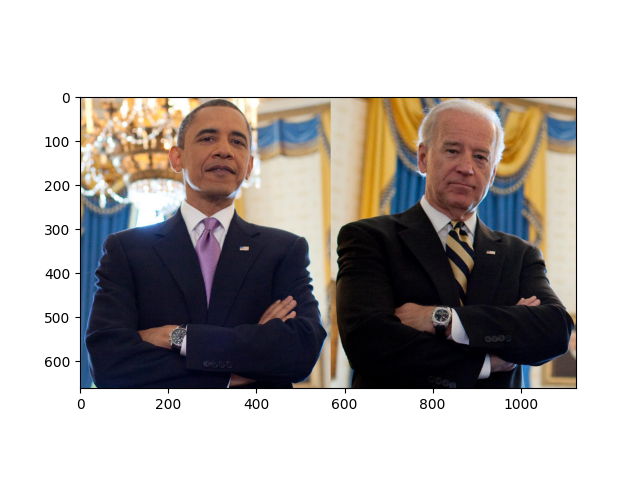
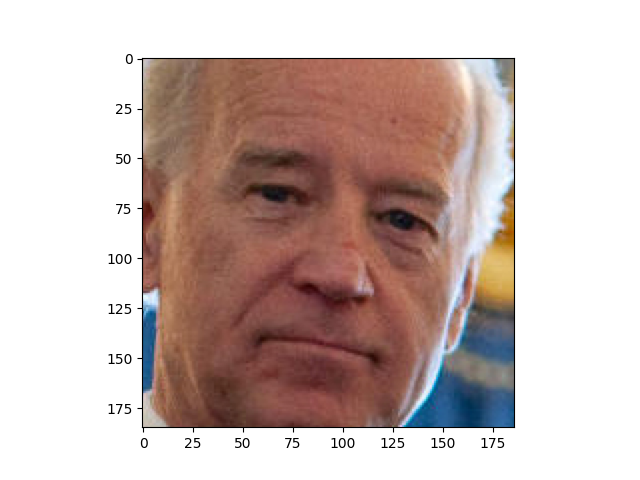
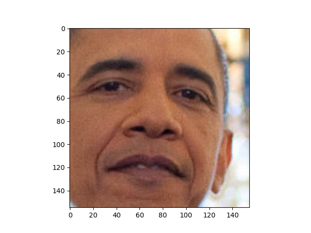
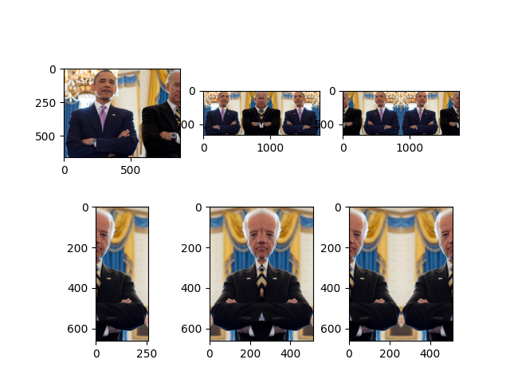
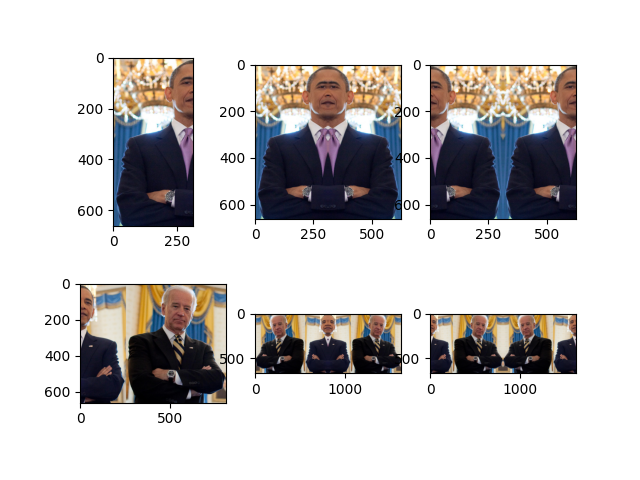

# face-symmetrizer

[](https://pypi.org/project/face-symmetrizer) [](https://github.com/eggplants/face-symmetrizer/releases)

- Easy symmetrizer for an image contained face(s)

## Install

```bash
pip install face-symmetrizer
```

## How

- Here is an example image of two people


### Command

```txt
$ fsym -h
usage: fsym [-h] [--show] [--save] [--outdir dir] file [file ...]

Easy symmetrizer for an image contained face(s)

positional arguments:
  file                  input image files

optional arguments:
  -h, --help            show this help message and exit
  --show, -s            show images (default: False)
  --save                save images (default: False)
  --outdir dir, -o dir  output directory of image (default: .)
```

- Detect with window and save symmetrized images to spesific dir (`outimg`)

```bash
fsym img/two_people.jpg -o outimg -s --save
```

### Library

- First, load an image

```python
from face_symmetrizer import FaceSym

# load from local file path
f = FaceSym("img/two_people.jpg")
# or, load from URL
# f = FaceSym("https://raw.githubusercontent.com/ageitgey/"
#             "face_recognition/master/examples/two_people.jpg")


# ATTRS: ['image_location',
#         'f_img', 'f_img_PIL', 'image_size',
#         'face_locations', 'face_landmarks',
#         'mid_face_locations', 'face_count']
```

- Get & show a full image

```python
f.get_full_image(show=True) #=> <PIL.Image.Image>
```



- Get & show an image of a rectangle drawn around a face.

```python
f.get_face_box_drawed_image(show=True) #=> <PIL.Image.Image>
```


- Get & show cropped face(s)

```python
f.get_cropped_face_images(show=True) #=> [<PIL.Image.Image>, ...]
```




- Get & show symmetrized images (face: 0)

```python
f.get_symmetrized_images(show=True, idx=0)
#=> (left_cropped, left_cropped_inner, left_cropped_outer,
#    right_cropped, right_cropped_inner, right_cropped_outer)
```



- Get & show symmetrized images (face: 1)

```python
f.get_symmetrized_images(show=True, idx=1)
```



## LICENSE

MIT
